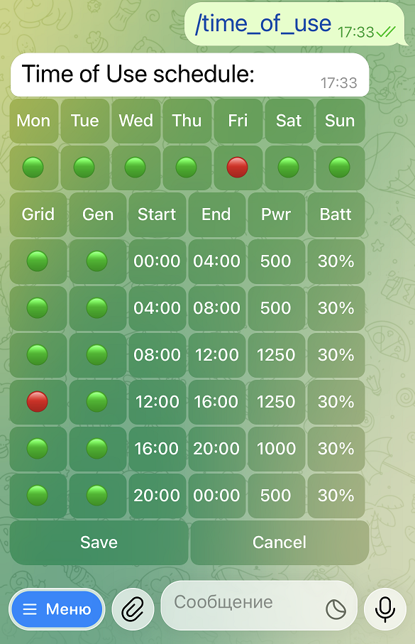
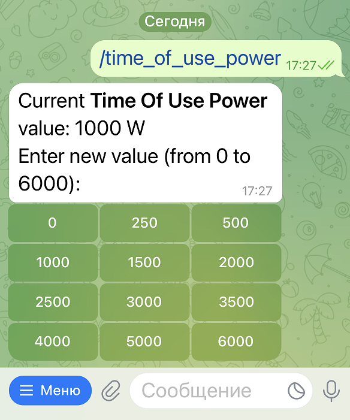
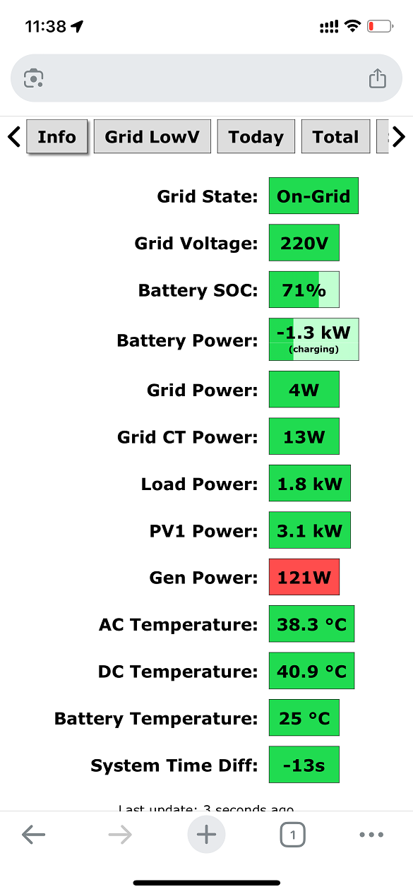

# Scripts + Telegram bot + Web interface for controlling Deye inverters (also supports parallel setup with arbitrary count of slave inverters)

I tested it on my **Deye SUN-6K-SG03LP1-EU**, but it also should work on other models from the same series.

If it doesn't work, you can configure registers for your own inverter.

Full manual is coming soon...

For now pls check some screenshots in <a href="images" target="_blank">images</a> folder

## Disclaimer

This software and associated scripts are provided "as is", without warranty of any kind, express or implied, including but not limited to the warranties of merchantability, fitness for a particular purpose, and non-infringement. In no event shall the authors or copyright holders be liable for any claim, damages, or other liability, whether in an action of contract, tort, or otherwise, arising from, out of, or in connection with the software or the use or other dealings in the software.

**Use at your own risk.**
