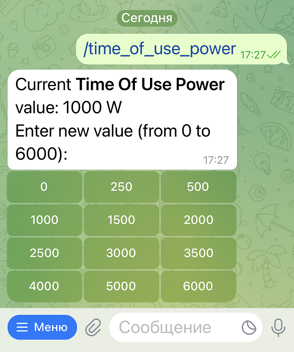

# Scripts + Telegram bot for controlling Deye inverters (also supports parallel setup with arbitrary count of slave inverters)

I tested it on my **Deye SUN-6K-SG03LP1-EU**, but it also should work on other models from the same series.

If it doesn't work, you can configure registers for your own inverter.

Full manual is coming soon...

For now pls check some screenshots in <a href="images" target="_blank">images</a> folder

